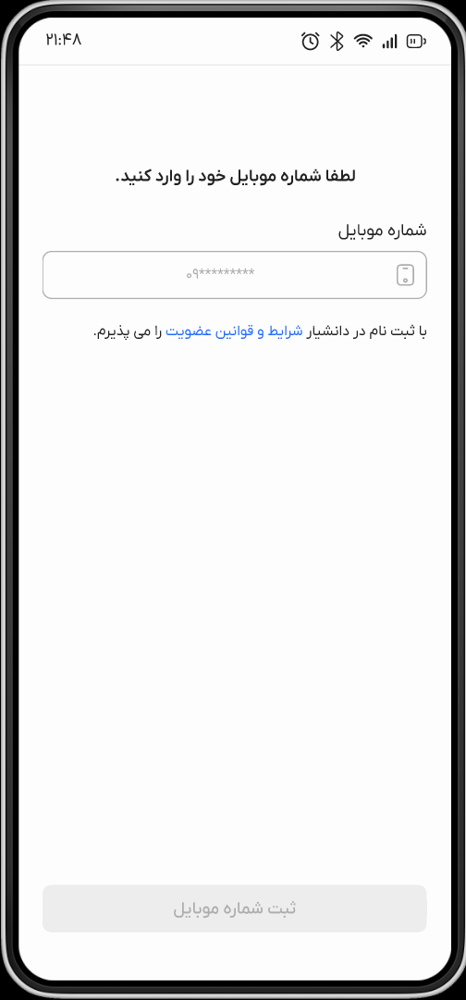
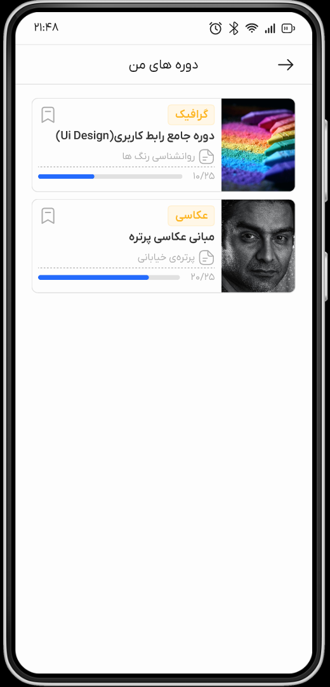
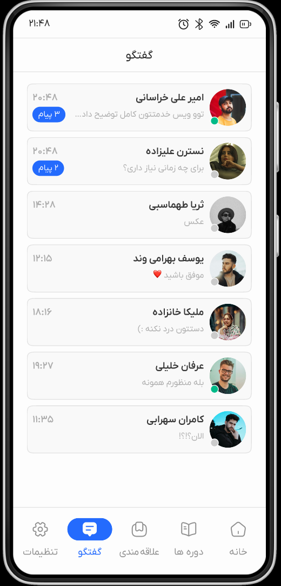

# 📚 Daneshyar – Modern Persian Educational Platform

Daneshyar is a modern **Persian (RTL) educational mobile app** designed for discovering courses, learning inside the app, and managing the full student journey — from **secure mobile login** to **in‑app purchases**, **chat**, and **progress tracking**.

> Built with **Flutter** and ready for Android & iOS. State management via **Riverpod**; networking via **Dio**; persists lightweight data with **SharedPreferences**.

---

## ✨ Key Features

* 🔐 **Easy & secure login with mobile number** (OTP-based)
* 👤 **Profile completion** (avatar, name, phone, etc.)
* 🔎 **Fast course search** with filters
* 📊 **Per‑course progress bar** so users can see how much of each course they have completed
* 📝 **Rich course & instructor descriptions** (syllabus, outcomes, prerequisites)
* 💳 **In‑app purchase** of courses
* 🎥 **Watch/consume courses inside the app** (videos & lessons)
* 💬 **In‑app chat & discussions**
* 📎 **Send files in chat** (images/documents)
* 🔔 **Push notifications** for updates, new lessons, and messages
* 🎯 Polished **onboarding** experience (glassmorphism design)
* 🌐 **REST API integration** for all dynamic data
* 🇮🇷 **Full Persian/RTL support**

---

## 🖼️ Screenshots

| Onboarding                                | Login                           | Courses                             | Course Details                      | Player                            | Chat                          |
| ----------------------------------------- | ------------------------------- | ----------------------------------- | ----------------------------------- | --------------------------------- | ----------------------------- |
|  |  |  |  |  |  |

> Replace the images above with real screenshots from your build.

---

## 🚀 Getting Started

### Prerequisites

* [Flutter SDK](https://flutter.dev/docs/get-started/install)
* Android Studio or VS Code
* Android/iOS emulator or a physical device

### Installation

```bash
# Clone
git clone https://github.com/<username>/daneshyar.git
cd daneshyar

# Install deps
flutter pub get

# Run (debug)
flutter run
```

### Configuration

Update your API endpoint and app constants in:

```
lib/core/constants/constants.dart
```

Example:

```dart
class AppConstants {
  static const String apiBaseUrl = "https://api.example.com"; // TODO: set real URL
}
```

---

## 📂 Project Structure

```
lib/
 ├─ core/            # Constants, theme, routing helpers
 ├─ features/        # Feature modules (auth, onboarding, courses, chat, profile, ...)
 │   ├─ auth/
 │   ├─ courses/
 │   ├─ chat/
 │   ├─ profile/
 │   └─ notifications/
 ├─ shared/          # Shared widgets, services, utils
 └─ main.dart        # Entry point
```

---

## 🛠️ Tech Stack

* **Flutter** — Cross‑platform UI
* **Riverpod** — State management
* **Dio** — HTTP client
* **SharedPreferences** — Local storage
* **(Optional)** **WebSocket/Socket.io** for real‑time chat
* **(Optional)** **FCM/OneSignal** for push notifications

> Note: Integrations for chat and notifications depend on your backend. The app is structured to plug these in cleanly.

---

## 🔄 Core Flows

### 1) Authentication (Mobile Number + OTP)

1. User enters mobile number → request OTP
2. Verify OTP → receive auth token
3. Persist token securely → navigate to app

### 2) Profile Completion

* Prompt user to add name, avatar, and optional details
* Save to server; cache minimal data locally

### 3) Course Discovery & Search

* Fetch categories/courses via REST
* Filter/search by keyword, category, price, etc.

### 4) Purchase Flow

* Show course details → purchase CTA
* Complete **in‑app purchase** → unlock content

### 5) Learning & Progress

* Stream/play lessons in app
* Save playback/lesson completion → update **progress bar** per course

### 6) Chat & File Sharing

* 1:1 or course‑room chat
* Attach images/documents (respect size/type limits)

### 7) Notifications

* Receive push notifications for new lessons, announcements, or chat messages

---

## ✅ Quality & Security

* **HTTPS** for all API calls
* **Input validation** & error handling
* **Token-based auth** (bearer)
* **Responsive layouts** for phones & tablets

---

## 🧪 Development Tips

* Use `flutter run -d <device>` for a specific target
* Add your logger/interceptor in Dio for debugging requests
* Keep feature modules isolated and testable

---

## 🤝 Contributing

Contributions are welcome! Please open an issue to discuss major changes.

1. Fork the repo
2. Create your feature branch: `git checkout -b feature/amazing`
3. Commit your changes: `git commit -m "feat: add amazing feature"`
4. Push to the branch: `git push origin feature/amazing`
5. Open a Pull Request

---

## 🗺️ Roadmap

* Offline downloads for lessons
* Advanced analytics for progress
* Multi‑language (FA/EN)
* Dark mode polish

---

## 📄 License

Distributed under the **MIT License**. See `LICENSE` for details.

---

## 👤 Maintainer

**Vahid Fotouhi**

* GitHub: [https://github.com/](https://github.com/)<username>
* Email: [your@email](mailto:your@email)
